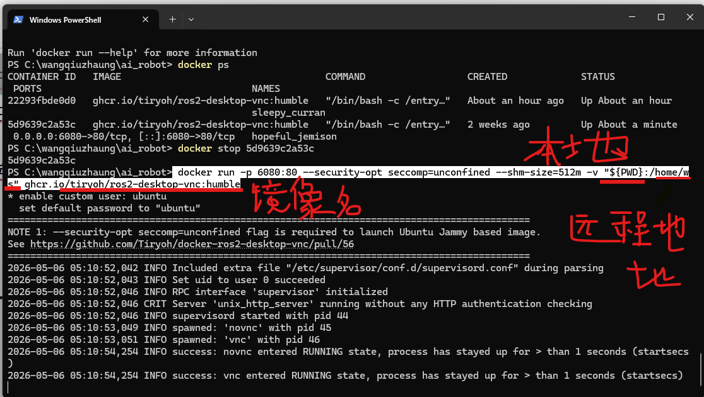
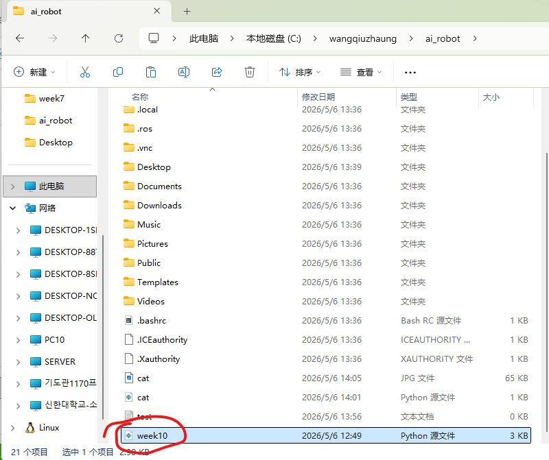
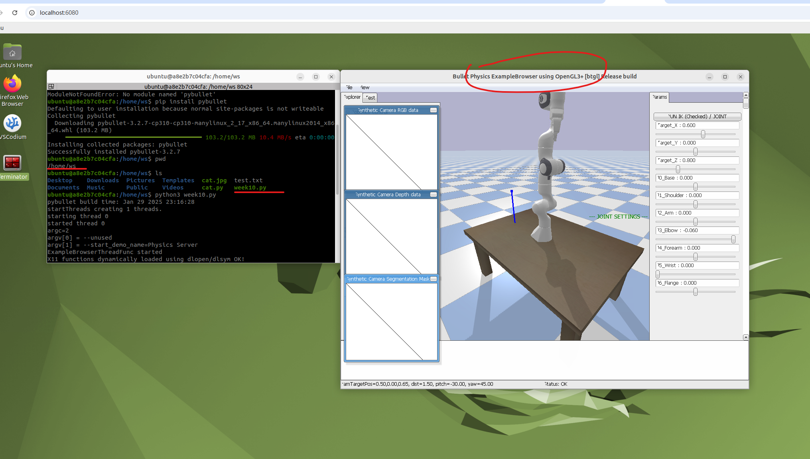
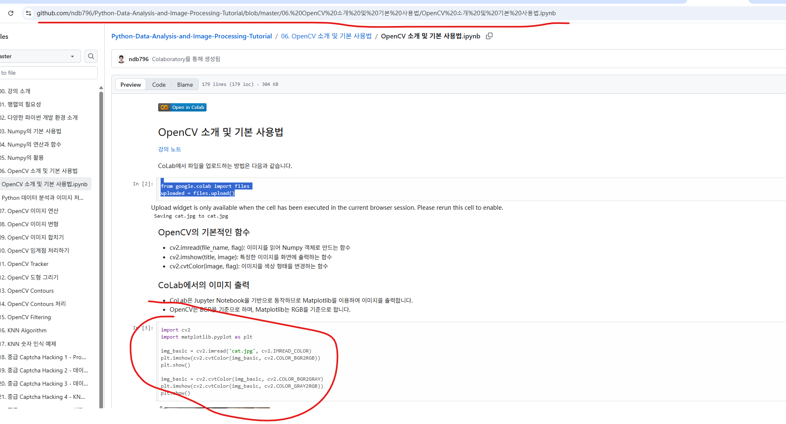
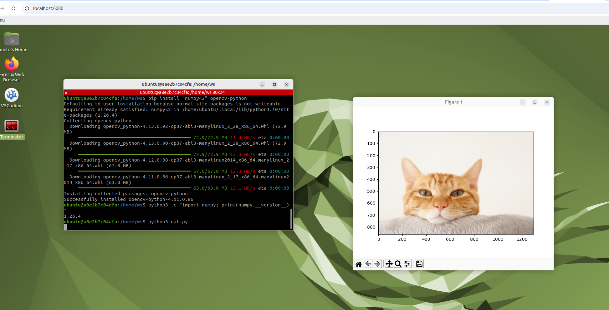

# Week 10: Docker 卷挂载与 OpenCV 图像处理

## 本周概览

- Docker `-v` 本地目录挂载与双向同步
- 远端文件操作与验证
- OpenCV 图像处理入门
- Python 依赖管理与版本兼容性问题排查

## 操作步骤

### 1. Docker 卷挂载 — 本地与远端文件同步

使用 `docker run -v` 将本地目录挂载到容器内。挂载成功后，本地文件的修改会实时同步到远端，反之亦然。即使远端文件被误删除，本地仍保留备份。



**关键要点**：PowerShell 退出后，本地与远端的虚拟连接会断开。

### 2. 文件同步验证

在本地创建一个 `.py` 文件，验证远端同步出现对应文件：



### 3. 远端运行 Python 文件

在远端容器中运行同步过来的 Python 文件，执行成功：



### 4. OpenCV 图像处理实验

从 GitHub 下载 OpenCV 教程代码并运行，成功显示小猫图像：





### 5. 踩坑记录

- **NumPy 版本不兼容**：运行 OpenCV 代码时可能遇到 NumPy 版本过高的问题，可将 NumPy 降级为 1.x 版本：
  ```bash
  pip3 install "numpy<2"
  ```
- **缺少 pybullet 模块**：使用 `pip3 install pybullet` 安装
- **缺少本地图片**：如果示例代码依赖的图片不存在，可从 Google 下载一张小猫图片替换

## 总结

本周掌握了 Docker 卷挂载的核心用法，实现了本地与容器间的双向文件同步；同时通过 OpenCV 教程代码的运行，完成了图像处理入门实验。版本兼容性问题的排查过程也加深了对 Python 依赖管理机制的理解。
