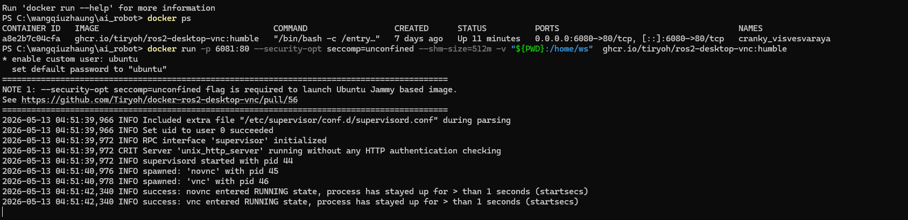
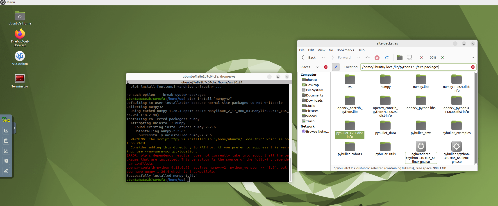
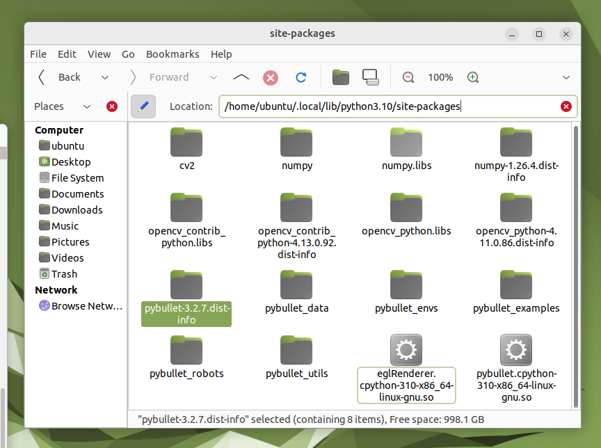
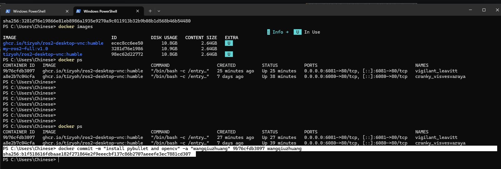
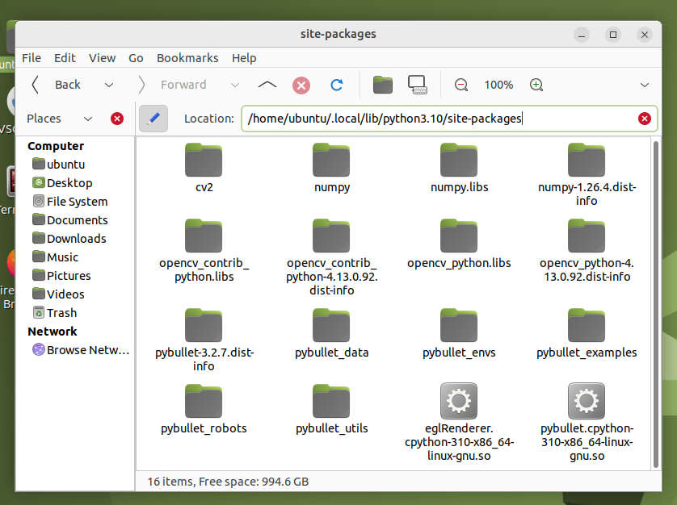

# Week 11: Docker 镜像持久化与 Git 仓库整理

## 本周概览

- Docker 常用指令学习与容器管理
- `docker commit` 镜像持久化保存
- 自定义镜像的启停验证
- Git 仓库整理与 GitHub Pages 部署

## 操作步骤

### 1. 启动 Docker Desktop 并打开镜像

先打开 Docker Desktop，启动目标镜像：


### 2. 绑定本地文件夹并启动容器

在 Windows PowerShell 中切换到 Docker 镜像绑定的本地文件夹，执行：

```bash
docker run -p 6081:80 --security-opt seccomp=unconfined --shm-size=512m -v "${PWD}:/home/ws" ghcr.io/tiryoh/ros2-desktop-vnc:humble
```

> **注意**：切换镜像名称；端口号被占用时更换一个可用端口即可。

### 3. 容器操作注意事项

绑定成功后 **PowerShell 窗口不能关闭**。一旦 Docker 镜像关闭，所有操作数据都会丢失。必须通过 `docker commit` 保存为新的镜像。



### 4. 进入 VNC 可视化界面

浏览器访问 `http://localhost:6081/` 进入 VNC 可视化界面，打开命令行终端：



### 5. 在容器内安装依赖包

在 VNC 终端中执行：

```bash
pip3 install pybullet
pip3 install opencv-python opencv-contrib-python
pip3 install "numpy<2"
```

安装完成后，进入 `/home/ubuntu/.local/lib/python3.10/site-packages`，确认三个包都已就位：



### 6. Docker Commit — 保存为自定义镜像

在 Windows PowerShell 中执行：

```bash
docker commit -m "install pybullet and opencv" -a "wangqiuzhuang" 9b76cfdb3097 wangqiuzhuang
```

返回结果：
```
sha256:b1f518616fdbaae182f271864e2f9eeecbf137c86b2707aeeefe3ec7881cd307
```



### 7. 验证镜像持久化

```bash
# 停止原容器
docker stop 9b76cfdb3097

# 验证进程已停止
docker ps

# 使用自定义镜像启动
docker run wangqiuzhuang
```

### 8. 验证已安装内容

重新连接 `6081` 端口，进入 `/home/ubuntu/.local/lib/python3.10/site-packages`，确认之前下载的文件依然存在：



> **提醒**：如果启动了多个镜像，务必确认操作的是 `6081` 端口，不要误操作到 `6080` 端口。

## 作业2：整理 Git 将 GitHub 作业仓库转为网页

### 目标

将 GitHub 作业仓库通过 GitHub Pages 部署为可公开访问的网页，便于课程系统自动检测和评分。

### 操作要点

1. **目录结构规范**：按周次组织文件夹（`week1/`, `week2/`, ...），每个文件夹包含 `README.md` 和 `img/` 子目录
2. **图片使用相对路径**：所有图片使用 `img/xxx.png` 格式引用，避免使用外部 URL，确保 100% 图片不碎链
3. **README 作为首页**：根目录 README.md 包含个人信息、技术栈、周次导航表格和链接
4. **启用 GitHub Pages**：Settings → Pages → Source: main branch, root folder
5. **可选配置 Jekyll 主题**：添加 `_config.yml` 选择主题美化页面

### 部署验证

- 确认网站可访问：`https://wangqiuzhuang.github.io/ai-robot-wangqiuzhuang/`
- 逐页检查图片加载和链接跳转
- 提交链接到课程系统

## 总结

本周完成了两个重要任务：一是掌握了 Docker 容器的镜像持久化技巧，通过 `docker commit` 将配置好的环境保存为自定义镜像；二是学习了 Git 仓库的规范化整理方法，理解了 GitHub Pages 部署流程，为课程作业的展示和评分做好了准备。
