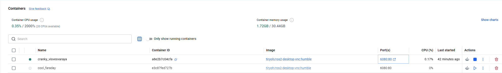

# wangqiuzhuang's 11th week's homework description  
## 本周概览  
- 学习常见的dockers指令,n\并安装一些软件，用docker commit保存操作，重启镜像发下自己的文件依然存在  
- docker ps 查看正在运行的dockers容器    
- docker ps -a 查看全部的dockers容器  包含已停止的    

## 操作步骤
1. 先打开docker Desktop  
2. 打开一个镜像   
3. 然后Windows本地打开一个Windows power shell,切换文件夹到dockers镜像绑定的本地文件夹地址，执行指令： docker run -p 6081:80 --security-opt seccomp=unconfined --shm-size=512m -v "${PWD}:/home/ws"  ghcr.io/tiryoh/ros2-desktop-vnc:humble（注意切换镜像名称，注意端口号占用直接喊个端口号即可）    
4. 绑定好之后窗口不能关闭，一旦docker镜像关闭，所有操作全部灭失。必须执行docker commit指令。  
  
5. http://localhost:6081/ 进入nvc可视化界面，打开命令窗口   
6. nvc命令行执行：  
安装 pybullet：pip3 install pybullet  
安装 opencv：pip3 install opencv-python opencv-contrib-python  
安装 numpy：pip3 install "numpy<2"  
7. 然后进入nvc可视化界面的文件路径下：/home/ubuntu/.local/lib/python3.10/site-packages，发现下载的三个包都已经就位。    
8. 然后Windows本地打开一个Windows power shell,执行：docker commit -m "install pybullet and opencv" -a "wangqiuzhuang" 9b76cfdb3097 wangqiuzhuang，最后的wangqiuzhuang代表镜像名称，  
返回内容：sha256:b1f518616fdbaae182f271864e2f9eeecbf137c86b2707aeeefe3ec7881cd307   
  
9. 验证： docker stop 9b76cfdb3097  停掉原来的镜像，然后docker ps验证进程是否停止。  
10. docker run wangqiuzhuang 发现自己的镜像地址启动成功，以后都用自己的镜像启动；  
11. 验证/home/ubuntu/.local/lib/python3.10/site-packages  自己下载的内容还存在    
12. 有可能你启动了多个镜像，读个端口一定记住你操作的是6081端口  别整成6080端口  
13. 最后验证重启重链接6081端口之后  自己下载的文件依然存在，大功告成！   

## 作业2   整理git将 GitHub 作业仓库转为网页