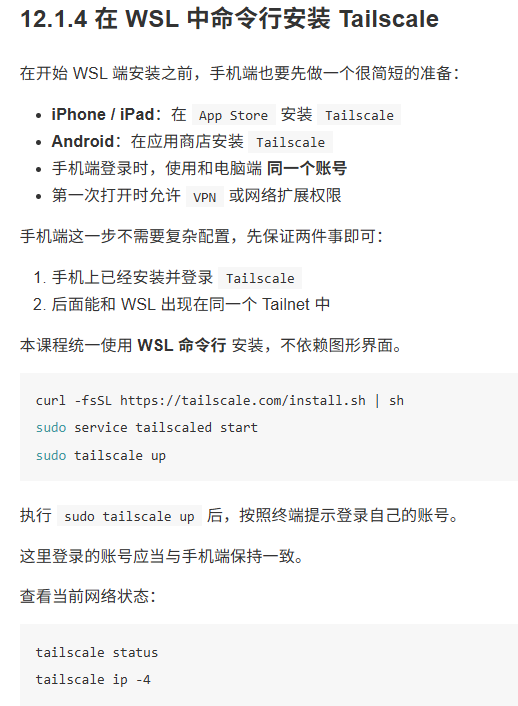
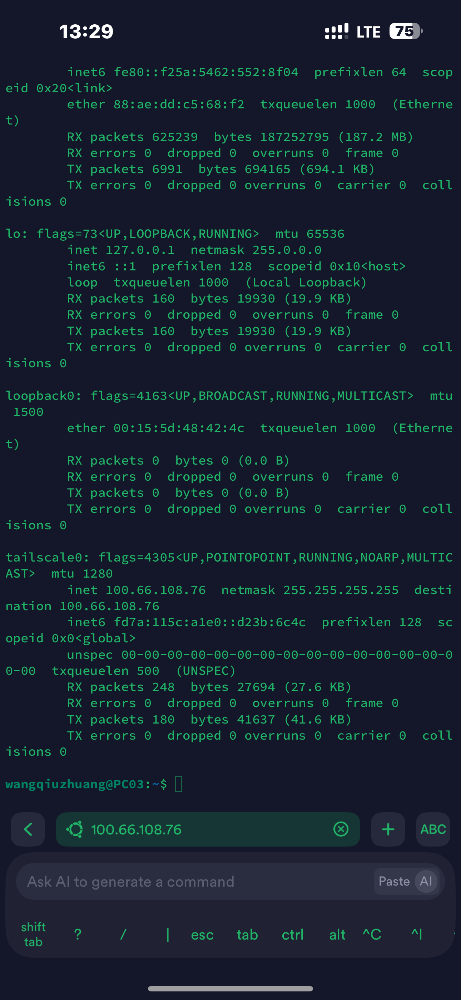
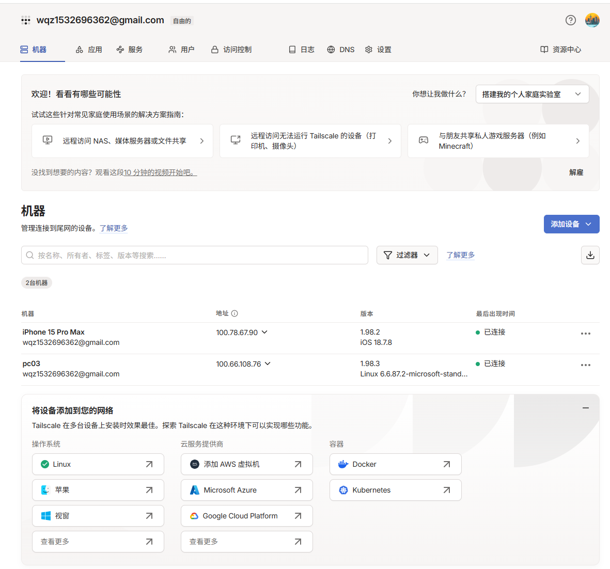
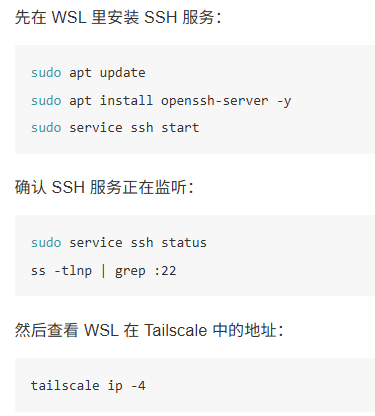
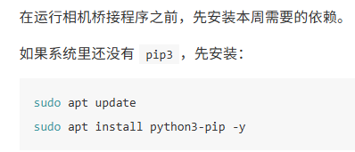
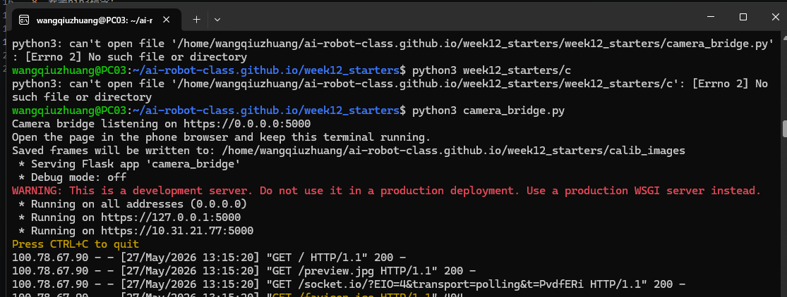
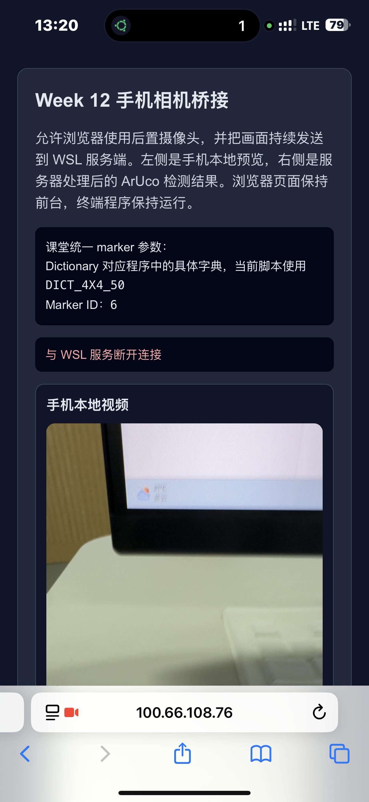
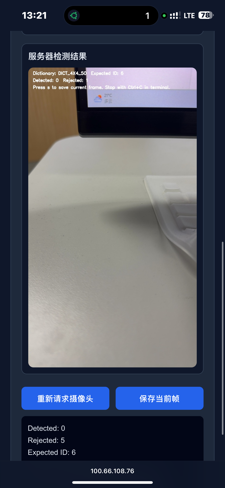
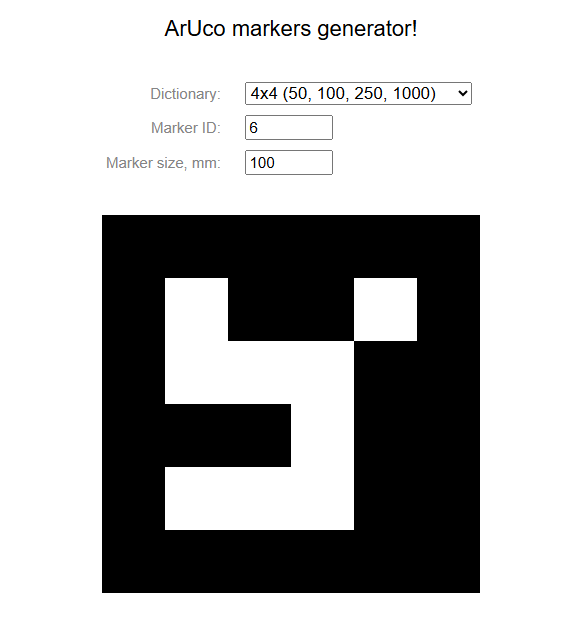
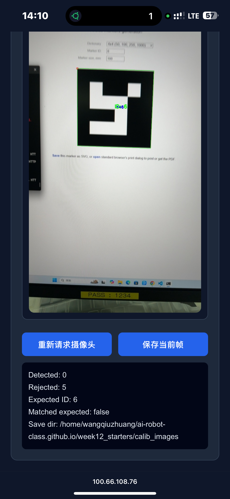

# wangqiuzhuang's 12th week's homework description  
## 本周概览  
-   

## 操作步骤
1. 课件地址:https://course.a-real.me/content/week12.html  
2. wsl安装Tailscale,并根据指引用Google账号登录  打开wsl执行指令:  

3. 手机商店下载,Tailscale,并根据指引用和第一步骤相同的Google账号登录
4. 手机下载终端工具Termius,远程连接上wsl,需要输入wsl的用户名和密码

5. 连接成功,同时在PC端控制台可以看到全部设备 

6. 在电脑上执行以下指令,安装ssh服务

7. wsl本地下载git项目:https://github.com/ai-robot-class/ai-robot-class.github.io.git  
8. 安装pip3指令:

9. 进入刚刚下载的git项目,进入指定文件夹,执行python脚本:pip install -r week12_starters/requirements.txt

10. wsl的ip地址:5000 实际ip地址和端口以实际为准,浏览器直接访问,会发起调用摄像头权限

11. 手机画面能够稳定出现在 WSL 的 OpenCV 窗口里。
12. 代码理解:
-- WSL 中起一个 HTTPS 页面
-- 手机浏览器打开页面
-- 页面调用摄像头
-- 页面把 JPEG 帧通过 WebSocket 发回 Python
-- Python 用 OpenCV 解码并显示
13. 模拟生成ArUco markers generator!     https://chev.me/arucogen/

14. 刷新浏览器,重新获取摄像头权限出发摄像头重现取样关键帧

15. 发现解析的数据和我们输入的图像数据是一样的,至此本次内容结束

## 有什么坑?
浏览器刷新一直超时,需要将wsl运行的程序杀死,然后重新run起来,浏览器刷新秒入