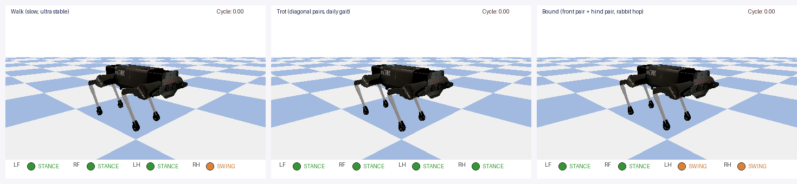
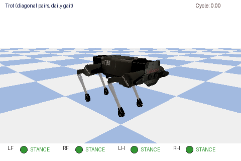
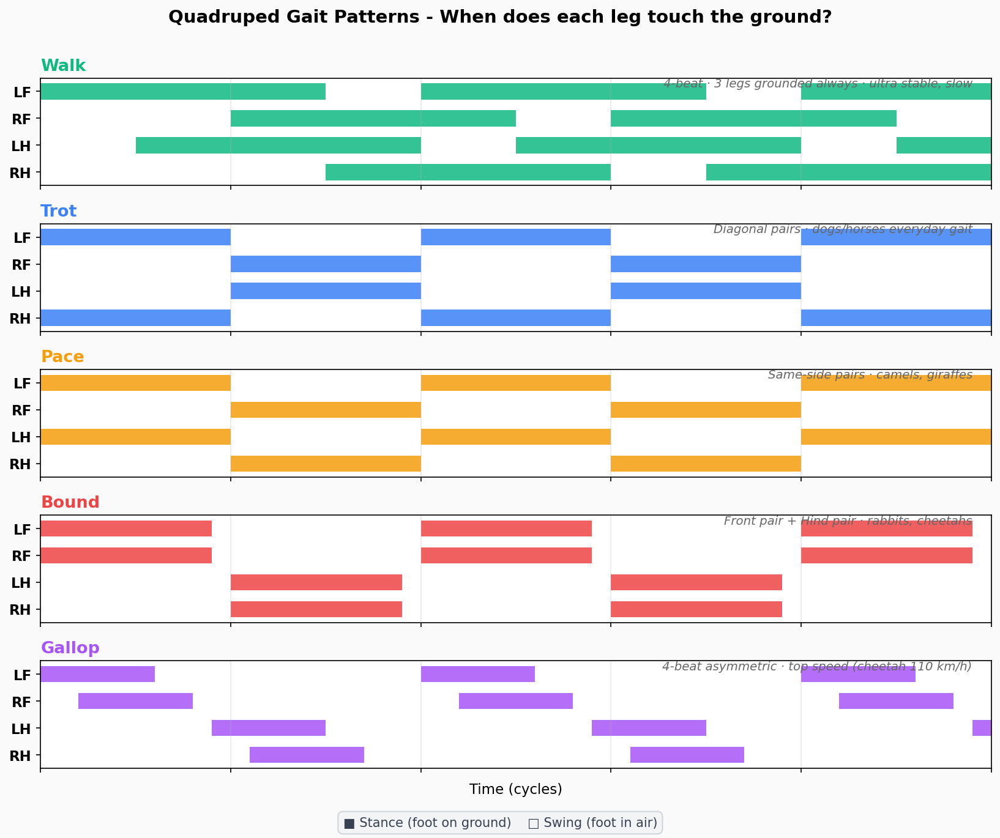
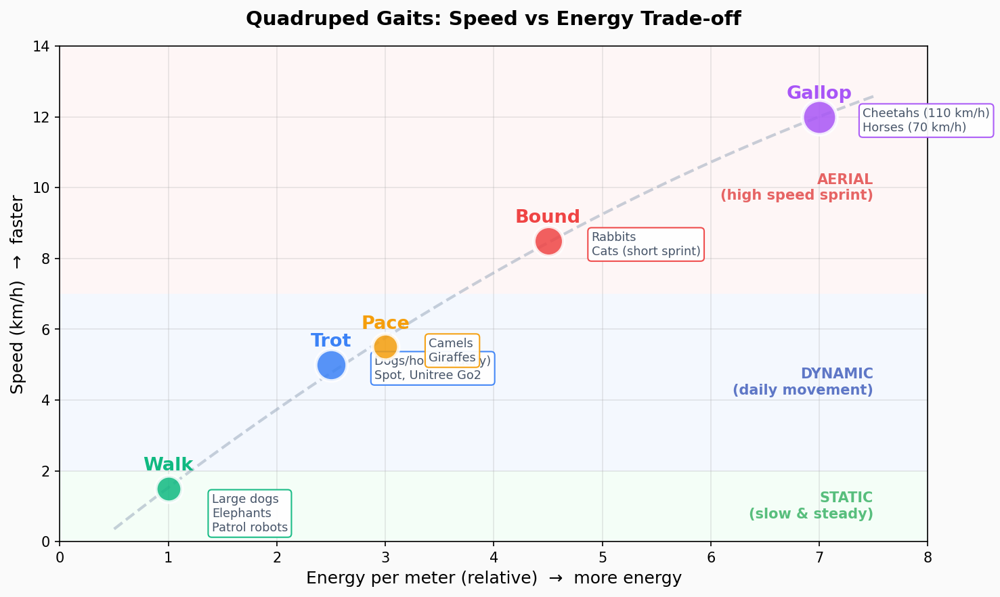

# 第 13 周：四足机器人仿真与强化学习


## 1. 学生推荐工作流

### 1.1 Fork 第 13 周代码仓库

在 GitHub 打开：

```text
https://github.com/ai-robot-class/week13
```

点击 **Fork**，将仓库复制到自己的账号下，例如：

```text
https://github.com/<your-github-name>/week13
```

后续如果需要修改第 13 周代码，应提交到自己的 fork，而不是直接修改官方仓库。

### 1.2 在作业仓库中添加自己的 fork 作为 submodule

进入自己的作业仓库根目录：

```bash
cd <student-homework-repo>
```

添加 submodule：

```bash
git submodule add https://github.com/<your-github-name>/week13.git week13
mkdir -p reports results
git add .gitmodules week13 reports results
git commit -m "Add week13 submodule"
```

作业仓库结构：

```text
student-homework-repo/
├── week13/                 # 学生 fork 后的 week13 submodule
├── reports/                # 实验报告、截图说明
├── results/                # 自己生成的视频、模型、GIF
└── README.md               # 作业说明
```

### 1.3 克隆作业仓库后初始化 submodule

```bash
git submodule update --init --recursive
```

```bash
git clone --recurse-submodules <student-homework-repo-url>
```

### 1.4 修改 week13 代码并提交

修改 `week13/` 中的代码，需要先进入 submodule：

```bash
cd week13
git checkout -b my-week13-experiment
```

修改代码后，在 `week13/` 目录内提交并推送到自己的 fork：

```bash
git add quadruped_ppo_residual_stairs.py
git commit -m "Improve week13 stair climbing reward"
git push origin my-week13-experiment
```

然后回到作业仓库根目录，提交 submodule 指针和作业材料：

```bash
cd ..
git add week13 reports results
git commit -m "Submit week13 quadruped experiment"
git push
```

注意：作业仓库记录的是 `week13` submodule 的具体提交指针。只在 submodule 内提交还不够，还需要回到作业仓库提交一次 `week13` 指针更新。

## 2. 安装依赖

在作业仓库根目录或 `week13/` 目录中运行：

```bash
pip install pybullet numpy gymnasium stable-baselines3 torch opencv-python imageio matplotlib pillow
```

## 3. 快速复现最终强化学习演示

在作业仓库根目录运行：

```bash
python3 week13/quadruped_ppo_residual_stairs.py demo --task stairs --model week13/ppo_residual_stairs.zip --stair_steps 4 --step_height 0.03 --init_x 0.00 --steps 500 --gui
```

无图形界面时录制视频：

```bash
python3 week13/quadruped_ppo_residual_stairs.py demo --task stairs --model week13/ppo_residual_stairs.zip --stair_steps 4 --step_height 0.03 --init_x 0.00 --steps 500 --record results/stairs_demo.mp4
```

预期现象：四足机器人能够明显向前爬上约三阶低台阶，但尚未满足“在最终台阶上稳定站住”的严格成功标准。


## 4. 第 13 周演示代码

### 4.1 PyBullet 入门：方块自由落体

```bash
python3 week13/demos/01_pybullet_box.py
```

对应讲义：PyBullet 基础仿真示例。

### 4.2 加载 Laikago 四足机器人

```bash
python3 week13/demos/02_load_laikago.py
```

对应讲义：加载 PyBullet 自带四足机器人模型。

### 4.3 简单正弦步态

```bash
python3 week13/demos/03_sine_gait.py
```

对应讲义：用正弦函数控制关节，观察对角腿相位差。

### 4.4 Trot 步态演示

```bash
python3 week13/demos/04_trot_gait.py
```

对应讲义：更清晰的 Trot 步态生成。

### 4.5 生成步态 GIF 与图表

```bash
python3 week13/scripts/generate_gait_gifs.py
python3 week13/scripts/generate_gait_diagrams.py
```

生成结果保存在：

```text
week13/assets/gaits/
```

## 5. 步态可视化素材

三种步态对比：



Trot 步态：



步态相位图：



速度与能耗对比：




## 7. 作业报告建议


# Week 13 四足机器人仿真与强化学习实验报告

## 运行的演示
- PyBullet 方块自由落体：
- Laikago 加载：
- 正弦步态：
- Trot 步态：
- PPO 爬楼梯：

## 修改内容
- 修改的文件：
- 修改的奖励项或参数：
- 修改原因：

## 实验结果
- 模型文件：dog3.py
- 视频文件：
- 最明显的进步：能够稳定站立并稳定行走.
- 仍然存在的问题：走的时间

## 作业交付物

| 文件 | 说明 |
|:---|:---|
| `quadruped_walk.py` | 四足机器人行走代码 (Trot 步态 + PPO 控制) |
| `ai_chat_log.md` | AI 辅助调试对话日志 (6 轮对话，覆盖环境配置、步态生成、PPO 调优) |
| `reflection.md` | 学习反思 (3 个问题，约 1350 字) |

## 验证

```bash
python -m py_compile week13/demos/04_trot_gait.py
python3 week13/demos/04_trot_gait.py
python3 week13/quadruped_ppo_residual_stairs.py demo --task stairs --model week13/ppo_residual_stairs.zip --stair_steps 4 --step_height 0.03 --init_x 0.00 --steps 500 --gui
```

提交作业：

```bash
git add reports results week13
git commit -m "Submit week13 quadruped simulation assignment"
git push
```

