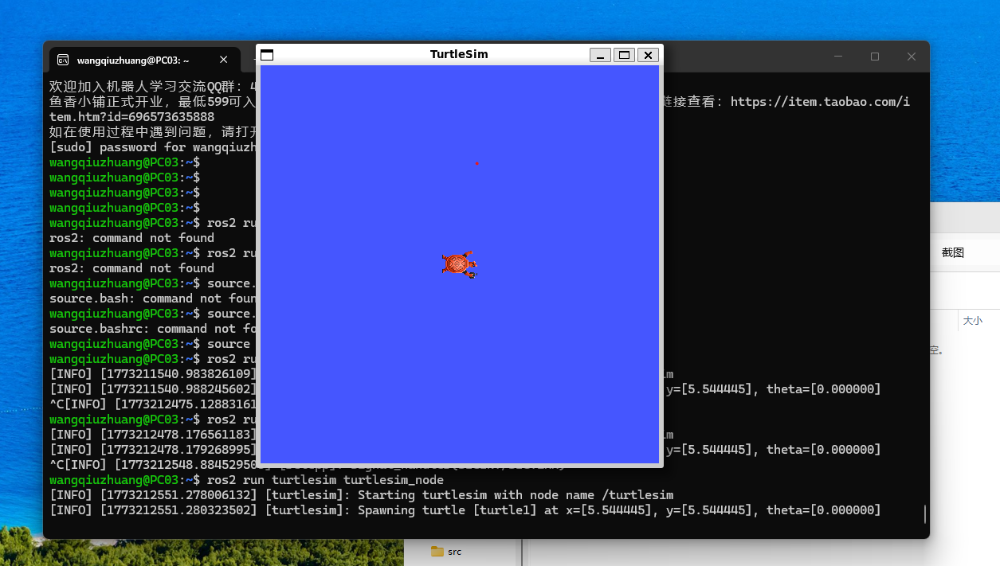

# Week 2: ROS2 环境配置与基础 CLI

## 本周概览

- ROS2 Humble 一键安装（鱼香ROS）
- ROS2 核心概念：节点 (Node)、话题 (Topic)、消息 (Message)
- turtlesim 小乌龟仿真入门
- colcon 构建工具与 ROS2 工作空间

---

## 1. ROS2 简介

ROS2（Robot Operating System 2）是用于机器人开发的开源中间件框架。相比 ROS1，ROS2 的核心改进：

| 特性 | ROS1 | ROS2 |
|:---|:---|:---|
| 通信协议 | 自定义 TCP/UDP | DDS（Data Distribution Service） |
| 操作系统 | 仅 Ubuntu | Ubuntu / Windows / macOS |
| 实时性 | 不支持 | 支持 Real-Time |
| 多机器人 | 需额外配置 | 原生支持分布式 |
| 节点生命周期 | 无管理 | Managed nodes |

### ROS2 核心通信模型

```
Node A (Publisher) ──Topic(/turtle1/cmd_vel)──▶ Node B (Subscriber)
                                                  │
                    Node C (Service Server) ◀─── Service Call ─── Node D (Client)
```

- **话题 (Topic)**：单向异步数据流，发布/订阅模式，用于传感器数据、控制指令等持续数据
- **服务 (Service)**：双向同步请求/响应，用于配置、触发动作等一次性操作
- **动作 (Action)**：带反馈的长时间任务，如导航、抓取

---

## 2. ROS2 Humble 安装

使用鱼香ROS一键安装脚本（国内推荐，自动处理依赖和镜像源）：

```bash
# 下载安装脚本
wget http://fishros.com/install -O fishros

# 运行安装（选择 ROS2 Humble）
bash fishros

# 配置环境变量
source ~/.bashrc
```

> 💡 **为什么选 Humble？** Humble Hawksbill 是 ROS2 的 LTS（长期支持）版本，支持 Ubuntu 22.04，社区生态最完善。后续 Iron 版本引入了更多新特性，但 Humble 仍是课程推荐版本。

### 验证安装

```bash
# 检查 ROS2 环境
echo $ROS_DISTRO    # 应输出 humble

# 查看 ROS2 版本
ros2 --version

# 运行第一个 ROS2 节点
ros2 run turtlesim turtlesim_node
```

---

## 3. turtlesim 小乌龟仿真

turtlesim 是 ROS2 内置的教学仿真器，用于学习话题通信、服务调用等核心概念。

### 关键命令

```bash
# 启动小乌龟仿真器（节点1）
ros2 run turtlesim turtlesim_node

# 新终端：键盘遥控（节点2）
ros2 run turtlesim turtle_teleop_key

# 查看当前运行的节点列表
ros2 node list

# 查看节点信息（订阅/发布的话题、提供的服务）
ros2 node info /turtlesim

# 查看所有活跃的话题
ros2 topic list

# 查看话题的发布频率和数据
ros2 topic echo /turtle1/pose

# 查看话题的消息类型
ros2 topic info /turtle1/cmd_vel
```

### 消息类型

`/turtle1/cmd_vel` 话题使用 `geometry_msgs/msg/Twist` 类型：

```yaml
Vector3 linear:
  float64 x  # 线速度 x (前进/后退)
  float64 y  # 线速度 y (左右平移)
  float64 z
Vector3 angular:
  float64 x
  float64 y
  float64 z  # 角速度 z (左右转向)
```

---

## 作业截图

### 小乌龟启动界面



---

## 踩坑记录

| 问题 | 原因 | 解决方案 |
|:---|:---|:---|
| `ros2: command not found` | 未 source 环境变量 | 执行 `source /opt/ros/humble/setup.bash` 或重开终端 |
| 小乌龟窗口闪退 | X11 显示未配置 | WSL2 需安装 VcXsrv 或使用 `export DISPLAY=:0` |
| `bash fishros` 下载慢 | 网络问题 | 挂代理或手动从清华镜像安装 |
| WSL2 中 GUI 不显示 | 缺少图形转发 | 安装 `sudo apt install x11-apps` 并配置 DISPLAY |

---

## 总结

本周掌握了 ROS2 的核心入门技能：

1. **ROS2 架构理解**：节点-话题-消息的发布/订阅通信模型
2. **环境搭建**：通过鱼香ROS高效完成 Humble 版本安装和配置
3. **turtlesim 实践**：使用 `ros2 node/topic` 命令行工具完成了第一个仿真实验
4. **消息机制**：理解了 Twist 消息结构如何控制小乌龟的运动

这些基础为后续的机器人运动学、传感器数据处理和仿真实验提供了命令行的交互基础。

## 代码说明

本周补充了两个 Python 脚本用于 ROS2 通信实验：

**`turtle_controller.py`** — 小乌龟速度控制器
- 向 `/turtle1/cmd_vel` 话题发布 Twist 速度指令
- 实现分阶段运动：前进 → 旋转 → 弧线 → 停止
- 使用 `create_publisher` + `create_timer` 实现周期性控制

**`turtle_pose_listener.py`** — 小乌龟位置监听器
- 订阅 `/turtle1/pose` 话题，接收 Pose 消息
- 实时打印位置坐标 (x, y)、朝向角 θ、线速度和角速度
- 使用 `create_subscription` 注册回调函数

## 运行方式

```bash
# 终端1: 启动小乌龟仿真器
ros2 run turtlesim turtlesim_node

# 终端2: 运行控制器 (小乌龟自动运动)
cd week2
python3 turtle_controller.py

# 或终端2: 运行位置监听器 (观察小乌龟位置)
python3 turtle_pose_listener.py
```
