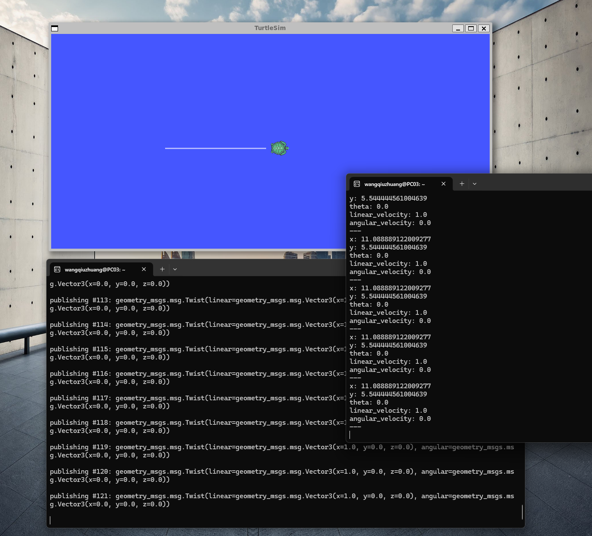
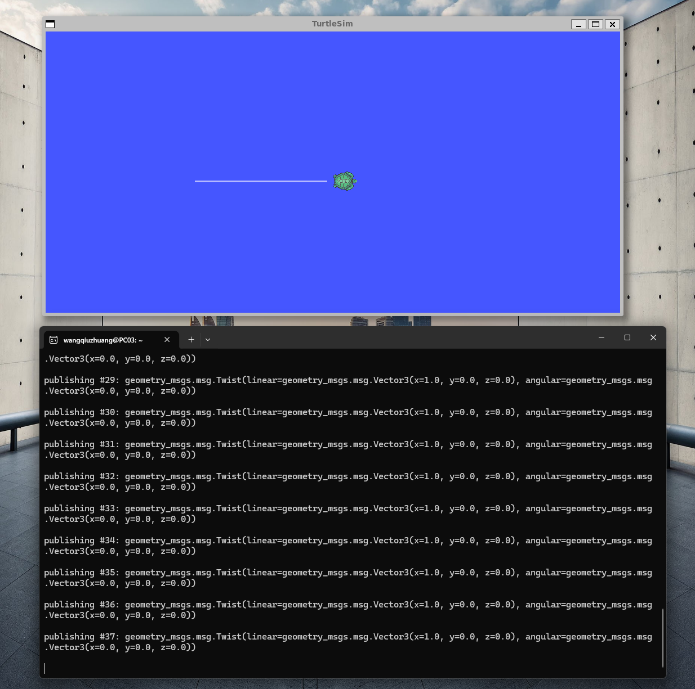

# Week 3: 机器人运动学核心概念与 ROS2 通信

## 本周概览

- Git SSH 密钥配置与 GitHub 交互
- VS Code + WSL 远程开发环境搭建
- ROS2 话题发布/订阅实战
- 机器人运动学初步：TF2 坐标变换
- URDF 机器人模型描述格式入门

---

## 1. Git SSH 密钥与远程仓库

### 为什么需要 SSH？

HTTPS 方式每次 push 都需要输入用户名和密码（或 token），而 SSH 方式配置一次后即可免密推送。

```bash
# 生成密钥（如未生成）
ssh-keygen -t ed25519 -C "your-email@example.com"

# 查看并复制公钥
cat ~/.ssh/id_ed25519.pub

# 测试连接
ssh -T git@github.com
# 成功输出: Hi wangqiuzhuang! You've successfully authenticated.
```

### Git 常用指令

```bash
# 远程仓库管理
git remote -v                    # 查看远程地址
git remote add origin <url>      # 添加远程仓库
git remote set-url origin <url>  # 修改远程地址 (HTTPS→SSH)

# 分支操作
git branch                       # 查看分支
git checkout -b feature          # 创建并切换分支

# 撤销操作
git reset --soft HEAD~1          # 撤销 commit 但保留更改
git restore <file>               # 丢弃工作区更改
git restore --staged <file>      # 取消暂存
```

---

## 2. VS Code + WSL 远程开发

### 配置步骤

1. 在 Windows 下载安装 [VS Code](https://code.visualstudio.com/)
2. 安装扩展 **WSL** (`ms-vscode-remote.remote-wsl`)
3. 安装扩展 **ROS** (`ms-iot.vscode-ros`)
4. 在 WSL 终端中进入项目目录，输入 `code .`
5. VS Code 自动连接 WSL，左下角显示 `WSL: Ubuntu`

### 优势

- Windows 图形界面 + Linux 开发环境
- 完整的 IntelliSense 代码补全
- 集成终端直接使用 WSL shell
- 断点调试 ROS2 Python/C++ 节点

---

## 3. ROS2 话题通信实战

### 实验：发布速度指令控制小乌龟

**终端 1** — 启动小乌龟节点：
```bash
ros2 run turtlesim turtlesim_node
```

**终端 2** — 监听小乌龟位置：
```bash
ros2 topic echo /turtle1/pose
```
每秒输出小乌龟的 x, y 坐标和 theta 朝向角。

**终端 3** — 发布速度指令让小乌龟移动：
```bash
ros2 topic pub /turtle1/cmd_vel geometry_msgs/msg/Twist "{linear: {x: 1.0, y: 0.0, z: 0.0}, angular: {x: 0.0, y: 0.0, z: 0.0}}"
```

> 💡 **原理解析**：`ros2 topic pub` 向 `/turtle1/cmd_vel` 话题发布一条 Twist 消息。turtlesim_node 订阅该话题，收到消息后更新小乌龟的位置。`echo` 命令订阅 `/turtle1/pose` 话题，实时输出位置反馈，形成闭环控制。

### 小乌龟位置监听



### 小乌龟移动控制



---

## 4. TF2 坐标变换基础

TF2（Transform Library 2）是 ROS2 中管理多个坐标系之间变换关系的库。

### 核心概念

- **坐标帧 (Frame)**：机器人上定义的位置参考点（如 `base_link`, `camera_link`, `laser_frame`）
- **变换 (Transform)**：两个帧之间的平移 + 旋转关系
- **TF 树 (TF Tree)**：所有坐标帧构成的父子关系树

```bash
# 查看 TF 树
ros2 run tf2_tools view_frames

# 监听特定两个帧之间的变换
ros2 run tf2_ros tf2_echo frame_a frame_b
```

### 为什么需要 TF2？

在机器人系统中，不同传感器安装在不同位置。要把激光雷达的数据转换到机器人基座坐标系下，就需要知道雷达相对于基座的位姿变换。TF2 自动维护和插值这些变换关系。

---

## 5. URDF — 机器人统一描述格式

URDF（Unified Robot Description Format）是 XML 格式的机器人模型描述文件：

```xml
<?xml version="1.0"?>
<robot name="my_robot">
  <!-- 基座连杆 -->
  <link name="base_link">
    <visual>
      <geometry>
        <cylinder radius="0.2" length="0.1"/>
      </geometry>
      <material name="blue">
        <color rgba="0 0 0.8 1"/>
      </material>
    </visual>
  </link>
  <!-- 关节连接 -->
  <joint name="base_to_wheel" type="continuous">
    <parent link="base_link"/>
    <child link="wheel_link"/>
    <origin xyz="0 0 0" rpy="0 0 0"/>
  </joint>
</robot>
```

| 元素 | 说明 |
|:---|:---|
| `<link>` | 机器人的刚性部件（连杆），定义几何形状、质量、惯性 |
| `<joint>` | 连接两个连杆的关节，定义运动类型（旋转/平移/固定） |
| `<visual>` | 可视化几何体（不影响物理仿真） |
| `<collision>` | 碰撞检测几何体（影响物理仿真） |

---

## 踩坑记录

| 问题 | 原因 | 解决方案 |
|:---|:---|:---|
| `git push` 提示输入密码 | 未配置 SSH 或使用了 HTTPS 远程 | `git remote set-url origin git@github.com:user/repo.git` |
| VS Code 无法连接 WSL | WSL 未启动或版本过旧 | `wsl --shutdown` 后重开, 确保 WSL 版本 ≥2 |
| `ros2 topic pub` 小乌龟不动 | 消息格式错误 | 用 Tab 键自动补全消息结构 |
| `colcon build` 报错 | 缺少依赖 | `rosdep install -i --from-path src --rosdistro humble -y` |

---

## 总结

本周在 ROS2 操作能力上迈出了关键一步：

1. **Git 工作流熟练化**：SSH 免密配置 + 常用分支/撤销指令
2. **VS Code 远程开发**：打通了 Windows IDE + WSL Linux 的混合开发环境
3. **话题通信实战**：通过 pub/echo 完成了 ROS2 的核心通信机制验证
4. **TF2 与 URDF 概念**：为后续多传感器融合和机器人建模仿真打下概念基础

## 代码说明

**`draw_circle.py`** — 小乌龟画圆控制器
- 发布恒定线速度 (1.5 m/s) + 恒定角速度 (1.0 rad/s)
- 利用圆周运动原理：v = ω × r，实现圆形轨迹
- 理论半径 r = 1.5m，周期 T = 2π 秒

**`turtle_spiral.py`** — 阿基米德螺旋线控制器
- 线速度恒定，角速度逐渐减小 → 半径逐渐增大
- 每 0.2 秒更新一次，step 越多螺旋越大

## 运行方式

```bash
# 终端1: 启动小乌龟
ros2 run turtlesim turtlesim_node

# 终端2: 画圆
cd week3
python3 draw_circle.py

# 或终端2: 画螺旋线
python3 turtle_spiral.py
```
