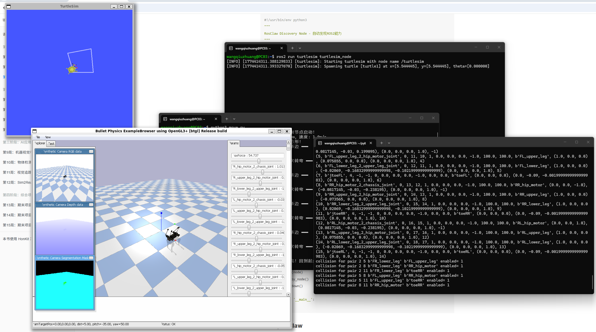
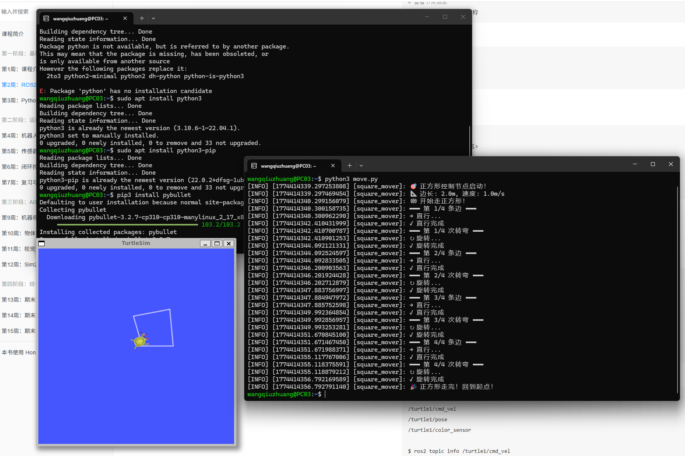

# Week 4: 机器视觉与 OpenCV 基础实验

## 本周概览

- 计算机网络基础：IP 地址、DNS、局域网/广域网
- SSH 安全外壳协议
- Linux 常用命令与文件操作
- PyBullet 物理引擎入门：Laikago 机器狗仿真
- Python + ROS2 控制小乌龟移动

---

## 1. 计算机网络基础

### IP 地址体系

| 概念 | 说明 | 示例 |
|:---|:---|:---|
| **IPv4** | 32位地址，点分十进制 | `192.168.1.1` |
| **IPv6** | 128位地址，冒号十六进制 | `2001:db8::1` (教育网常用) |
| **DNS** | 域名→IP 的解析服务 | `baidu.com` → `110.242.68.66` |
| **回环地址** | 本机自通信 | `127.0.0.1` |
| **局域网 (LAN)** | 同一路由器下的私有网络 | `192.168.x.x` |
| **广域网 (WAN)** | 互联网范围的公网 | 通过 `ip138.com` 查询公网 IP |

### 网络连通性测试

```bash
# ping — 测试网络可达性
ping 8.8.8.8          # Google DNS
ping www.baidu.com    # 域名解析 + 连通

# 查看本机 IP
ip addr show          # Linux
ipconfig              # Windows
```

> 💡 **公网 vs 内网**：家庭路由器使用 NAT（网络地址转换）将多个设备的内网 IP 映射到一个公网 IP，实现共享上网。

---

## 2. SSH 安全外壳协议

SSH (Secure Shell) 通过加密通道实现安全的远程登录和命令执行：

```bash
# 基本格式
ssh 用户名@远程主机地址

# 示例
ssh wangqiuzhuang@192.168.1.100

# 使用 SSH 密钥（免密登录）
ssh-copy-id wangqiuzhuang@192.168.1.100  # 复制公钥到远程
ssh wangqiuzhuang@192.168.1.100          # 之后无需密码
```

**原理**：SSH 使用非对称加密建立安全通道。首次连接时交换公钥，后续通信使用对称加密保证效率。

---

## 3. Linux 常用文件操作指令

```bash
pwd                     # 输出当前目录的绝对路径
ls                      # 列出当前目录下的文件
ls -la                  # 详细列表（含隐藏文件、权限、大小）
cd <目录路径>            # 切换工作目录
mkdir <目录名>           # 创建新目录
mv <源> <目标>           # 移动或重命名文件/目录
cp <源> <目标>           # 复制文件
rm <文件名>              # 删除文件
rm -r <目录名>           # 递归删除目录
cat <文件名>             # 查看文件内容
```

---

## 4. PyBullet 机器狗仿真

### 什么是 PyBullet？

PyBullet 是 Bullet Physics 引擎的 Python 封装，支持刚体动力学仿真、碰撞检测、机器人运动学等。它是目前学术界和工业界广泛使用的开源物理引擎。

### 运行 Laikago 四足机器人仿真

```bash
# 克隆 PyBullet 示例代码
git clone https://github.com/bulletphysics/pybullet_robots

# 进入目录
cd pybullet_robots

# 运行 Laikago 机器狗仿真
python3 laikago.py
```

### 修改关节参数 — 放倒机器狗

`laikago.py` 中控制机器狗姿态的关键代码模式：

```python
# 遍历所有关节并设置角度
for joint in range(p.getNumJoints(robot_id)):
    # 关闭位置控制，切换到力矩控制
    p.setJointMotorControl2(
        bodyIndex=robot_id,
        jointIndex=joint,
        controlMode=p.VELOCITY_CONTROL,
        targetVelocity=0,
        force=0
    )
```

通过修改关节目标角度，可以改变机器狗的站立姿态，甚至放倒机器狗。

### 放倒机器狗



---

## 5. Python 控制小乌龟

使用 Python 脚本替代命令行工具来控制 turtlesim，实现更精确轨迹控制：

```python
#!/usr/bin/env python3
import rclpy
from rclpy.node import Node
from geometry_msgs.msg import Twist

class TurtleController(Node):
    def __init__(self):
        super().__init__('turtle_controller')
        self.publisher = self.create_publisher(
            Twist, '/turtle1/cmd_vel', 10)
        self.timer = self.create_timer(0.5, self.move)

    def move(self):
        msg = Twist()
        msg.linear.x = 1.0   # 前进速度
        msg.angular.z = 0.5  # 旋转速度（画弧线）
        self.publisher.publish(msg)

def main():
    rclpy.init()
    rclpy.spin(TurtleController())
    rclpy.shutdown()
```

> 完整代码参见课件：[course.a-real.me/content/week3.html](https://course.a-real.me/content/week3.html)

### 小乌龟走正方向



---

## 踩坑记录

| 问题 | 原因 | 解决方案 |
|:---|:---|:---|
| `python3 laikago.py` 报错 no module 'pybullet' | 未安装 PyBullet | `pip3 install pybullet` |
| PyBullet 窗口显示异常 | WSL 图形转发未配置 | 安装 VcXsrv 并设置 `export DISPLAY=:0` |
| 机器狗放倒后无法恢复 | 力矩控制下关节自由掉落 | 重新启动仿真即可 |
| SSH 连接超时 | 防火墙阻拦 / 服务未启动 | `sudo ufw allow 22`，`sudo systemctl start sshd` |

---

## 总结

本周从网络基础到机器人仿真，建立了机器人开发的完整底层认知：

1. **网络通信**：理解了 IP/DNS/NAT/SSH 在机器人远程控制中的作用
2. **Linux 操作**：掌握了文件管理的核心命令行工具
3. **PyBullet 仿真**：完成了四足机器狗的加载、关节修改和姿态控制
4. **Python-ROS2 交互**：用代码替代命令行实现了小乌龟的精确运动控制

为后续 Docker 容器化和传感器数据处理提供了网络和仿真的基础能力。

## 代码说明

**`turtle_square.py`** — 小乌龟正方形轨迹控制器
- 8 阶段状态机：4 边前进 + 4 次 90° 转弯
- 边长 2m，线速度 1m/s，角速度 π/2 rad/s
- 完成后自动停止

**`laikago_demo.py`** — PyBullet Laikago 四足机器狗控制
- 加载 Laikago URDF 模型到 PyBullet 仿真环境
- 打印 12 个关节的详细信息 (名称/类型/范围)
- 实现放倒 (零力矩) 和站立 (位置控制) 姿态切换

## 运行方式

```bash
# 正方形轨迹
ros2 run turtlesim turtlesim_node &
cd week4
python3 turtle_square.py

# Laikago 仿真
pip install pybullet
python3 laikago_demo.py
```
