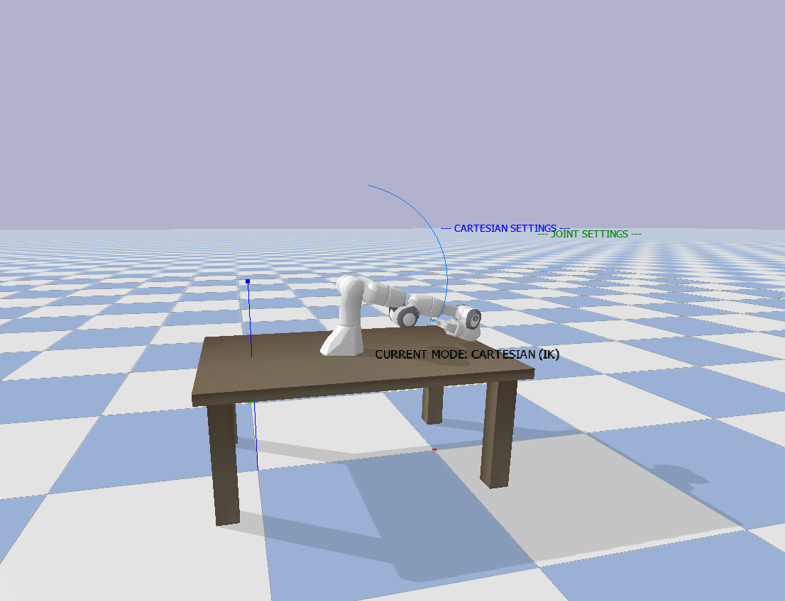

# Week 5: 机器人运动学与机械臂控制

## 本周概览

- Linux 终端操作进阶
- 机器人运动空间：关节空间 vs 笛卡尔空间
- 正运动学 (Forward Kinematics) 与逆运动学 (Inverse Kinematics)
- Panda 机械臂仿真控制实验
- 机械臂轨迹规划：直线与圆弧

---

## 1. Linux 终端操作进阶

```bash
# 目录导航
pwd                     # 当前路径
ls -la                  # 详细信息列表
cd /path/to/dir         # 切换目录
cd ..                   # 返回上级
cd ~                    # 返回家目录

# 文件管理
touch file.txt          # 创建空文件
nano file.txt           # 终端文本编辑器
cat file.txt            # 查看文件内容

# 权限管理
chmod +x script.py      # 添加可执行权限
sudo <command>          # 以管理员身份执行
```

---

## 2. 机器人运动空间

机器人控制涉及两个核心空间概念：

### 关节空间 (Joint Space)

用各关节的角度（或位移）描述机器人状态：

```
θ = [θ₁, θ₂, θ₃, θ₄, θ₅, θ₆]  （6自由度机械臂）
```

- **优势**：无奇异问题，直接控制电机，避障容易
- **劣势**：末端轨迹不直观

### 笛卡尔空间 (Cartesian Space / Task Space)

用末端执行器的位置和姿态描述：

```
P = [x, y, z, roll, pitch, yaw]
```

- **优势**：直观（我要末端走到桌面上方），适合抓取任务
- **劣势**：有奇异点，需要 IK 求解

> 💡 **实际工程中**：轨迹规划通常在笛卡尔空间设计（如画直线），然后通过逆运动学转换为关节角度指令，发送给电机。

---

## 3. 正运动学与逆运动学

### 正运动学 (Forward Kinematics, FK)

**已知**：各关节角度 θ₁...θₙ
**求**：末端执行器的笛卡尔位置 (x, y, z) 和姿态

```
FK: θ → (x, y, z, roll, pitch, yaw)
```

FK 计算是**确定的**——给定关节角度，末端位置唯一确定。通过 DH 参数法或乘积指数公式递推计算。

### 逆运动学 (Inverse Kinematics, IK)

**已知**：期望的末端位置 (x, y, z) 和姿态
**求**：各关节角度 θ₁...θₙ

```
IK: (x, y, z, roll, pitch, yaw) → θ
```

IK 计算是**非线性的**——
- 可能有**多解**（同一位置，手臂肘部可朝上或朝下）
- 可能有**无解**（目标位置超出工作空间）
- 在**奇异点**附近解不稳定

---

## 4. Panda 机械臂轨迹控制实验

### 作业目标

指挥 Panda 机械臂末端画圆——机械臂末端沿圆形轨迹运动。

### 原理

```python
# 伪代码：笛卡尔空间画圆 → IK 求解 → 关节控制
import numpy as np

radius = 0.1         # 圆半径 (m)
center = [0.5, 0.0, 0.4]  # 圆心在机械臂前方

for angle in np.linspace(0, 2*np.pi, 100):
    # 1. 笛卡尔空间：计算圆周上的目标点
    x = center[0] + radius * np.cos(angle)
    y = center[1] + radius * np.sin(angle)
    z = center[2]

    # 2. 逆运动学：转换为关节角度
    joint_angles = inverse_kinematics(x, y, z)

    # 3. 发送关节指令
    robot.set_joint_positions(joint_angles)
```

> ⚠️ 画正圆比较困难，因为 IK 求解在极端位置可能不收敛。建议先用椭圆或八边形近似。

### 作业截图：机械臂运动并展示轨迹



---

## 踩坑记录

| 问题 | 原因 | 解决方案 |
|:---|:---|:---|
| 机械臂画不出正圆 | IK 解在圆周某些点不连续 | 增加轨迹点数，降低速度，或者画多边形近似 |
| 机械臂抖动 | 关节速度指令不平滑 | 对关节角度序列做插值/平滑滤波 |
| 末端达不到目标位置 | 目标超出工作空间 | 缩小圆半径或调整圆心位置 |
| IK 求解器报错 | 初始猜测角度不合适 | 使用当前关节角度作为 IK 求解的初始值 (seed) |

---

## 总结

本周从理论到实践完整覆盖了机器人运动学的核心内容：

1. **运动空间概念**：理解了关节空间和笛卡尔空间的区别与适用场景
2. **FK vs IK**：掌握了"正运动学确定、逆运动学非唯一"的核心思想
3. **轨迹规划**：在 Panda 机械臂上实现了笛卡尔空间的轨迹控制

这些知识是后续四足机器人步态规划和仿真控制的理论基础。

## 代码说明

**`panda_circle.py`** — Panda 机械臂画圆演示
- 在笛卡尔空间生成 100 个圆周轨迹点
- 逐点调用 `calculateInverseKinematics` 求解关节角度
- 使用 smoothstep 缓动函数实现关节空间平滑过渡
- 实时计算末端跟踪误差

**`panda_ik_demo.py`** — 正运动学/逆运动学对比演示
- FK: 测试 4 种关节配置 (零位/前伸/上举/右偏)，观察末端位置
- IK: 指定 4 个目标位置，求解并验证关节角度和跟踪精度

## 运行方式

```bash
pip install pybullet numpy
cd week5
python3 panda_circle.py    # 画圆演示
python3 panda_ik_demo.py   # FK/IK 对比
```
