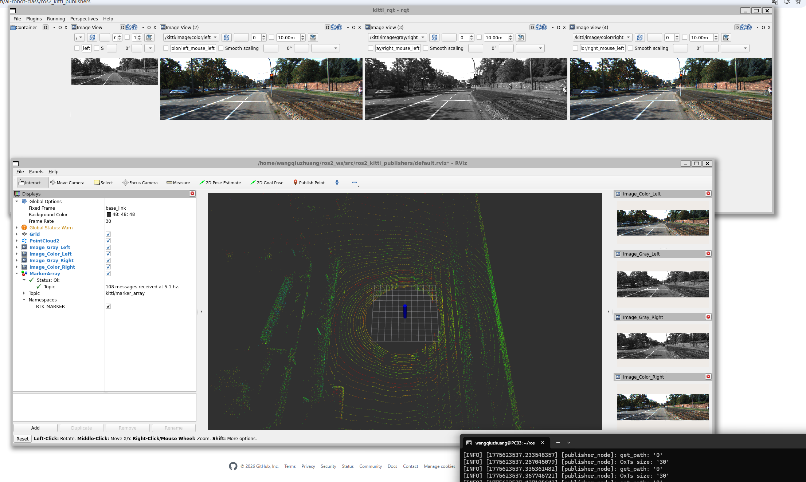
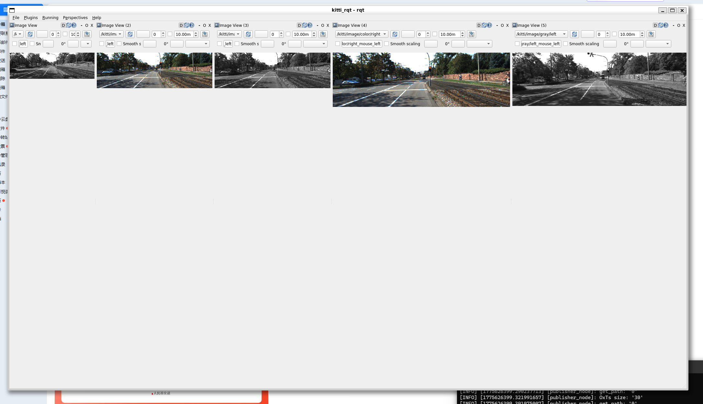

# Week 6: 传感器数据处理与 KITTI 数据集实验

## 本周概览

- 机器人常用传感器类型与原理
- ROS2 传感器消息类型
- KITTI 自动驾驶数据集简介
- RViz2 传感器数据可视化
- RQT 数据流调试工具

---

## 1. 机器人常用传感器

### 传感器分类

| 传感器 | 数据类型 | 用途 | ROS2 消息类型 |
|:---|:---|:---|:---|
| **RGB 相机** | 2D 图像 | 物体检测、识别、跟踪 | `sensor_msgs/Image` |
| **激光雷达 (LiDAR)** | 3D 点云 | 建图、定位、避障 | `sensor_msgs/PointCloud2` |
| **IMU** | 加速度 + 角速度 | 姿态估计、里程计 | `sensor_msgs/Imu` |
| **GPS** | 经纬度 + 海拔 | 全局定位 | `sensor_msgs/NavSatFix` |
| **超声波** | 距离值 | 近距离避障 | `sensor_msgs/Range` |

### 激光雷达原理

LiDAR (Light Detection and Ranging) 发射激光束，通过测量反射时间计算距离：

```
距离 = (光速 × 飞行时间) / 2

360° 扫描 → 64/128 线束 → 每秒百万级点云数据
```

---

## 2. KITTI 数据集

KITTI 是自动驾驶领域最知名的公开数据集之一，由德国卡尔斯鲁厄理工学院和丰田美国技术研究院联合创建。

### 数据集内容

```
KITTI/
├── image_02/      # 左彩色相机图像
├── image_03/      # 右彩色相机图像
├── velodyne/      # 64线激光雷达点云
├── calib/         # 传感器标定参数
└── oxts/          # GPS/IMU 数据
```

### 传感器配置

车辆顶部安装 64 线 Velodyne HDL-64E 激光雷达，同时搭载 4 个相机（2 彩色 + 2 灰度），构成完整的多模态感知系统。

---

## 3. ROS2 传感器实验

### RQT — 可视化调试工具

RQT 是 ROS2 的插件化图形调试工具，支持话题监控、节点图可视化、数据绘图等功能：

```bash
# 启动 RQT
rqt

# 常用插件
# - rqt_graph: 节点/话题关系图
# - rqt_plot: 话题数据实时曲线
# - rqt_image_view: 图像话题预览
# - rqt_console: 日志过滤器
```

### 实验步骤

1. 加载 KITTI 数据集到 ROS2 环境
2. 发布相机图像和 LiDAR 点云到对应话题
3. 使用 RViz2 进行 3D 可视化
4. 截取车辆不同视角的相机画面

### ROS2 传感器数据



### RQT 数据流监控



---

## 4. 多视角截图展示

### 车辆摄像头视角说明

| 视角 | 相机位置 | 用途 |
|:---|:---|:---|
| **前视 (Front)** | 挡风玻璃后方 | 车道线、交通标志、前车检测 |
| **左前 (Front-Left)** | 左后视镜区域 | 左侧盲区、变道辅助 |
| **右前 (Front-Right)** | 右后视镜区域 | 右侧盲区、变道辅助 |
| **后视 (Rear)** | 后挡风玻璃 | 倒车、后方来车检测 |

---

## 踩坑记录

| 问题 | 原因 | 解决方案 |
|:---|:---|:---|
| RViz2 无法显示点云 | 未设置 Fixed Frame | 在 RViz2 中将 Fixed Frame 设为 `velodyne` |
| RQT 启动报错 | 插件未安装 | `sudo apt install ros-humble-rqt-*` |
| KITTI 数据加载失败 | 文件路径不匹配 | 检查 bag 文件中的 topic 名称与实际一致 |
| 点云显示为散乱噪点 | 未正确设置 Intrinsics | 在 RViz2 中调整 PointCloud2 显示的 Decay Time |

---

## 总结

本周从传感器理论到数据可视化完成了完整的感知数据处理流程：

1. **传感器认知**：掌握了相机、LiDAR、IMU、GPS 的工作原理和 ROS2 消息格式
2. **KITTI 数据集**：理解了自动驾驶数据集的采集方式和组织结构
3. **可视化工具**：熟练使用 RViz2 进行 3D 点云/图像显示，RQT 进行话题级调试
4. **多视角理解**：通过摄像头视角切换加深了对自动驾驶感知系统的整体认识

为后续 Docker 容器中的传感器处理和四足机器人感知模块开发提供了数据基础。
