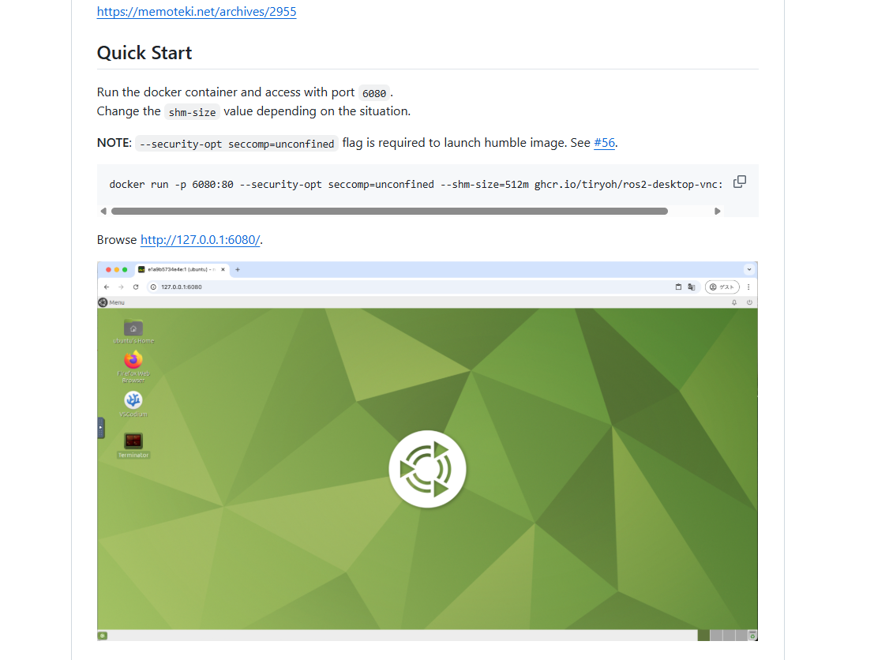
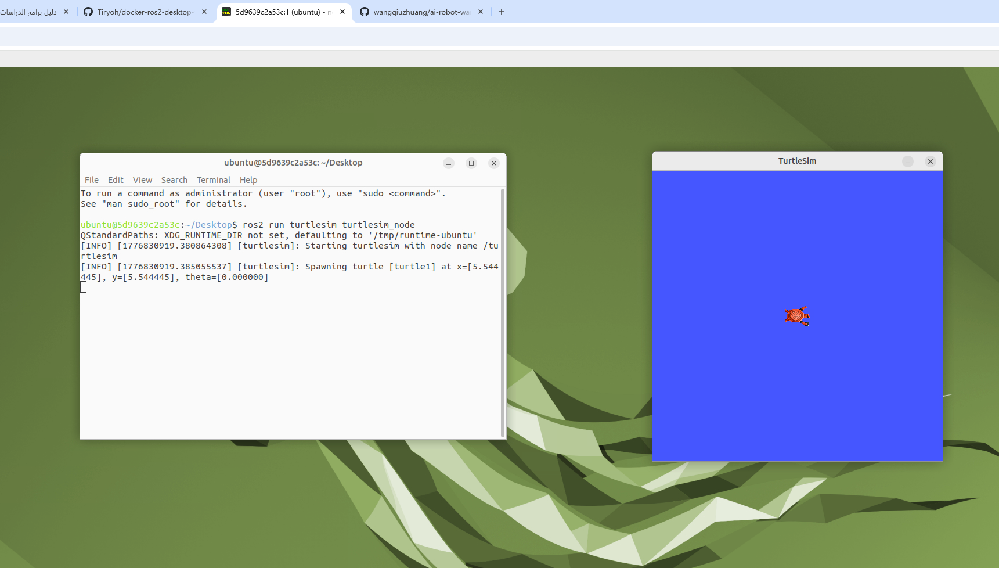

# Week 7: Docker 容器环境与 ROS2 桌面 VNC

## 本周概览

- Docker 容器技术原理与架构
- Docker Desktop 安装与配置
- Tiryoh/ros2-desktop-vnc 镜像使用
- VNC 远程桌面连接
- 容器中运行 ROS2 turtlesim

---

## 1. Docker 技术原理

### 容器 vs 虚拟机

```
传统虚拟机:                         Docker 容器:
┌─────────────────┐                ┌─────────────────┐
│ App A │ App B   │                │ App A │ App B   │
├────────┬────────┤                ├────────┬────────┤
│ Guest  │ Guest  │                │ Docker Engine  │
│ OS     │ OS     │                ├─────────────────┤
├────────┴────────┤                │   Host Kernel   │
│   Hypervisor    │                ├─────────────────┤
├─────────────────┤                │   Hardware      │
│   Host OS       │                └─────────────────┘
├─────────────────┤
│   Hardware      │
└─────────────────┘
```

| 维度 | 虚拟机 | Docker 容器 |
|:---|:---|:---|
| 启动速度 | 分钟级 | 秒级 |
| 内存占用 | GB 级 | MB 级 |
| 磁盘占用 | 数十 GB | 数百 MB |
| 隔离级别 | 完全隔离 (Hypervisor) | 进程隔离 (Namespace) |
| 性能 | 接近原生但有损耗 | 几乎等于原生 |

### Docker 核心概念

- **镜像 (Image)**：只读模板，包含运行环境和应用代码（类比"安装盘"）
- **容器 (Container)**：镜像的运行实例（类比"运行中的程序"）
- **仓库 (Registry)**：镜像存储和分发中心（Docker Hub ≈ "GitHub for 镜像"）

---

## 2. ROS2 Desktop VNC 镜像

### 镜像说明

`ghcr.io/tiryoh/ros2-desktop-vnc:humble` 是一个预配置的 ROS2 桌面容器镜像：
- 内置 Ubuntu 22.04 + ROS2 Humble
- XFCE 桌面环境
- noVNC 网页远程桌面（浏览器即可访问）
- 无需配置 X11 转发，WSL2 开箱即用

### 安装 Docker Desktop

在 Windows 下载 [Docker Desktop](https://www.docker.com/products/docker-desktop/)，安装后确保 WSL2 后端已启用。

### 快速开始

在 **PowerShell** 中执行：

```bash
# 拉取镜像
docker pull ghcr.io/tiryoh/ros2-desktop-vnc:humble

# 运行容器
docker run -p 6080:80 --shm-size=512m ghcr.io/tiryoh/ros2-desktop-vnc:humble
```

> **参数说明**：
> - `-p 6080:80`：将容器的 80 端口映射到本机 6080 端口
> - `--shm-size=512m`：增加共享内存，避免 GUI 应用崩溃



---

## 3. VNC 远程桌面连接

### 访问方式

1. 浏览器打开 `http://127.0.0.1:6080`
2. 进入 XFCE 桌面环境（完整 Linux 桌面）
3. 打开终端，输入 ROS2 命令：

```bash
source /opt/ros/humble/setup.bash
ros2 run turtlesim turtlesim_node
```

> 💡 **原理**：noVNC 将 VNC 协议封装为 WebSocket，浏览器无需安装任何插件即可访问完整的 Linux 桌面环境。

### Docker 中运行小乌龟



---

## 4. 容器生命周期管理

```bash
# 查看运行中的容器
docker ps

# 查看所有容器（含已停止）
docker ps -a

# 停止容器
docker stop <container-id>

# 重新启动已停止的容器
docker start <container-id>

# 删除容器
docker rm <container-id>

# 删除镜像
docker rmi <image-name>
```

---

## 踩坑记录

| 问题 | 原因 | 解决方案 |
|:---|:---|:---|
| 端口 6080 访问无响应 | 容器未正确启动或端口冲突 | `docker ps` 确认容器在运行，检查端口映射 |
| 容器内 GUI 程序崩溃 | 共享内存不足 | 添加 `--shm-size=512m` 参数 |
| WSL2 中无法运行 Docker | Docker Desktop 未集成 WSL2 | Docker Desktop → Settings → Resources → WSL Integration |
| 浏览器连接被拒绝 | 防火墙阻拦或端口号错误 | 检查 Windows 防火墙，确认使用 127.0.0.1 而非 localhost |
| 容器关闭后数据丢失 | 未做持久化 | 使用 `docker commit` 保存容器状态（Week 11 详讲） |

---

## 总结

本周跨越了从原生 ROS2 到容器化 ROS2 的关键一步：

1. **容器原理理解**：掌握了 Docker 的镜像-容器-仓库架构以及相比虚拟机的优势
2. **ROS2 Desktop VNC**：实现了浏览器即可访问的完整 ROS2 桌面开发环境
3. **跨平台开发**：WSL2 + Docker Desktop 打通了 Windows → Linux 的开发链路
4. **生命周期管理**：掌握了 docker pull/run/ps/stop/start/rm 的基本运维命令

Docker 容器化是 Week 10-12 高级实验的基础，后续将深入卷挂载、镜像提交和跨设备通信。

## 代码说明

**`docker_run.sh`** — Docker ROS2 VNC 一键启动脚本
- 自动检查 Docker 安装状态和服务运行状态
- 拉取 `ghcr.io/tiryoh/ros2-desktop-vnc:humble` 镜像
- 清理旧容器 → 启动新容器 → 验证运行状态
- 输出浏览器访问地址和常用 ROS2 命令提示

**`vnc_connect.sh`** — VNC 连接辅助脚本
- 验证容器运行状态
- 输出浏览器访问地址和容器内文件位置
- 列出常用 ROS2 命令参考

## 运行方式

```bash
cd week7
chmod +x docker_run.sh vnc_connect.sh
./docker_run.sh            # 启动 ROS2 桌面容器
./vnc_connect.sh           # 查看连接信息
# 浏览器打开: http://127.0.0.1:6080
```
